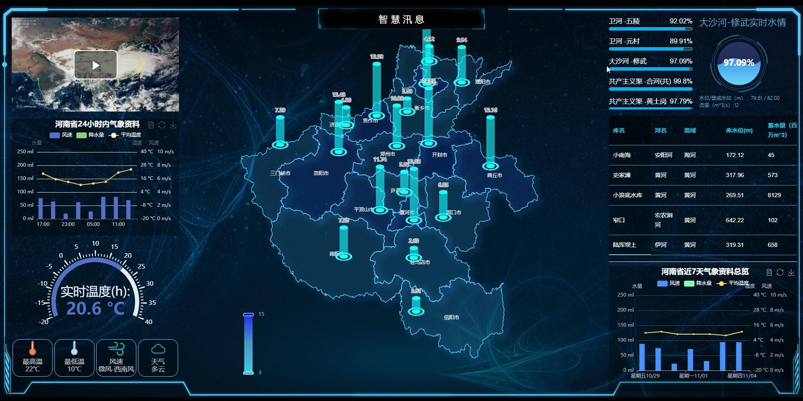
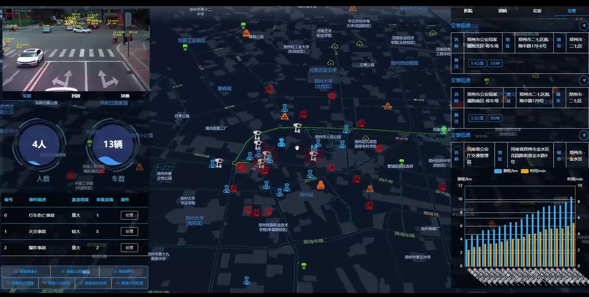
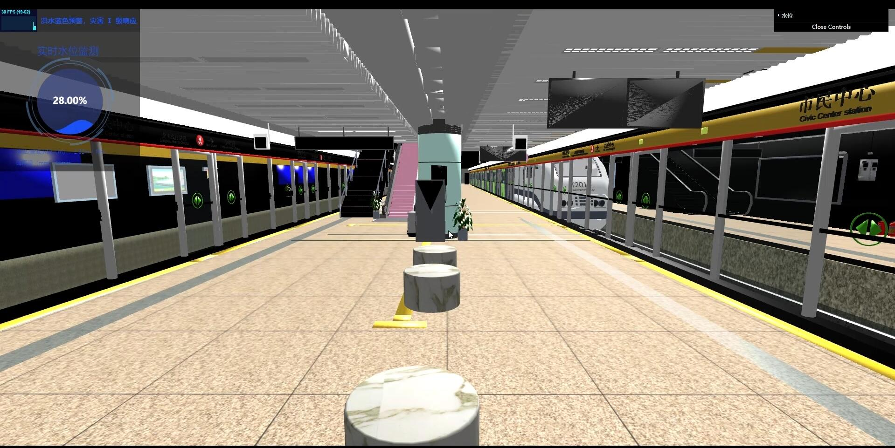
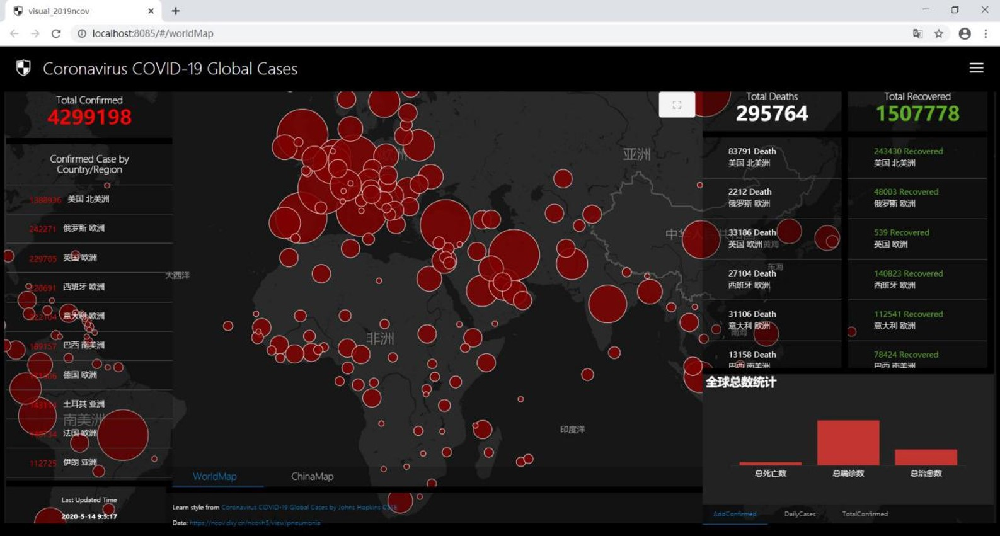
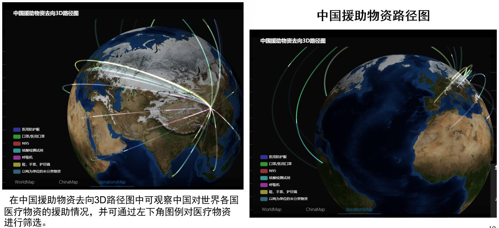
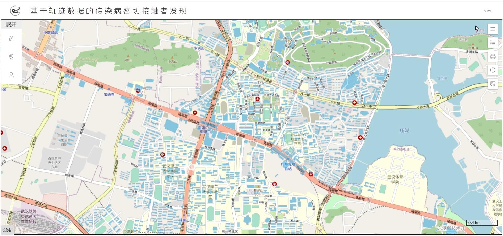
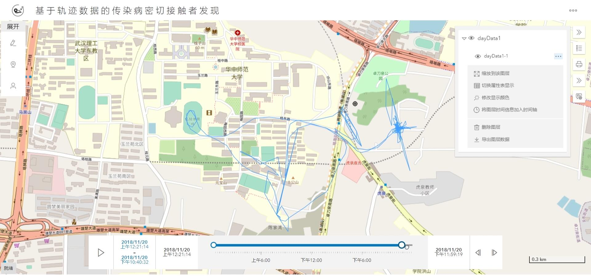
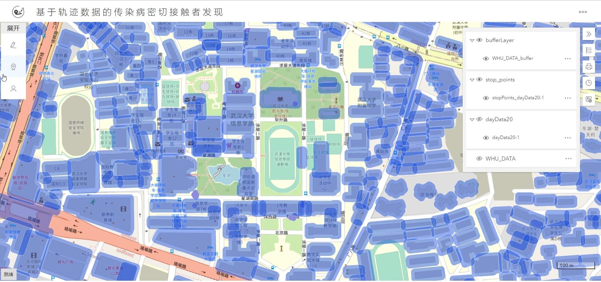
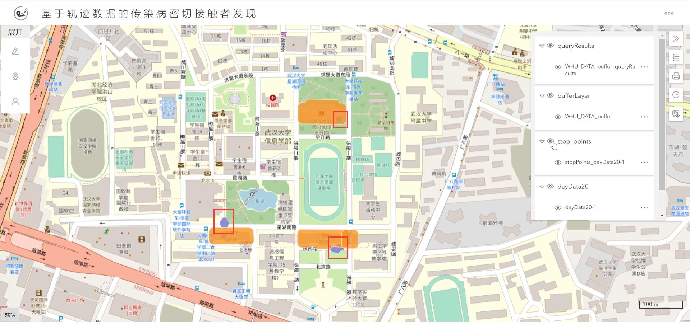
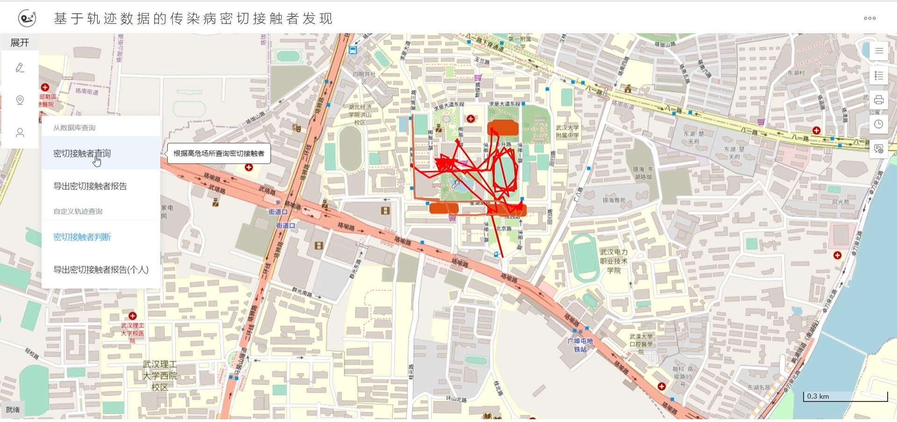

# 实习项目展示

## 1 多类目标计数

​		其中，第一列为遥感影像，第二列为真实标注，第三列为网络输出预测结果。（绿色为大车，红色为小车）

## 2 智慧汛息

### 2.1 以河南省为例，各地区水情雨晴展示

### 2.2 城市应急灾害响应

### 2.3 three.js 三维展示

* 地铁站三维模型展示

* 地铁站淹没三维展示

## 3 新冠疫情相关项目

### 3.1 新冠疫情可视化

* 确诊人数、死亡人数、痊愈人数等可视化展示

* 中国援助物资可视化展示

### 3.2 基于轨迹的传染病密切接触者发现

* 基础界面展示（以武汉大学为例）

* 轨迹可视化

* 建筑物缓冲区分析

* 轨迹停留点查询

* 密切接触者发现

